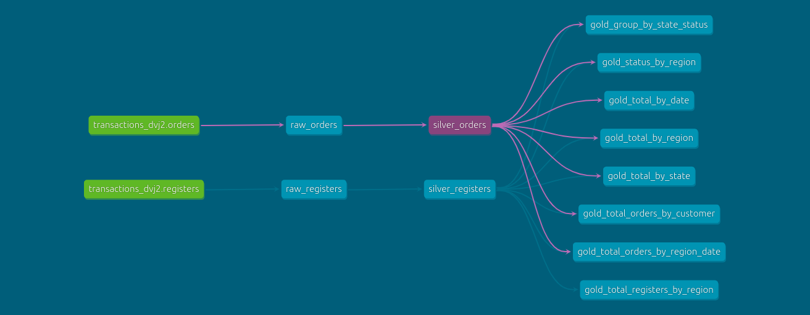
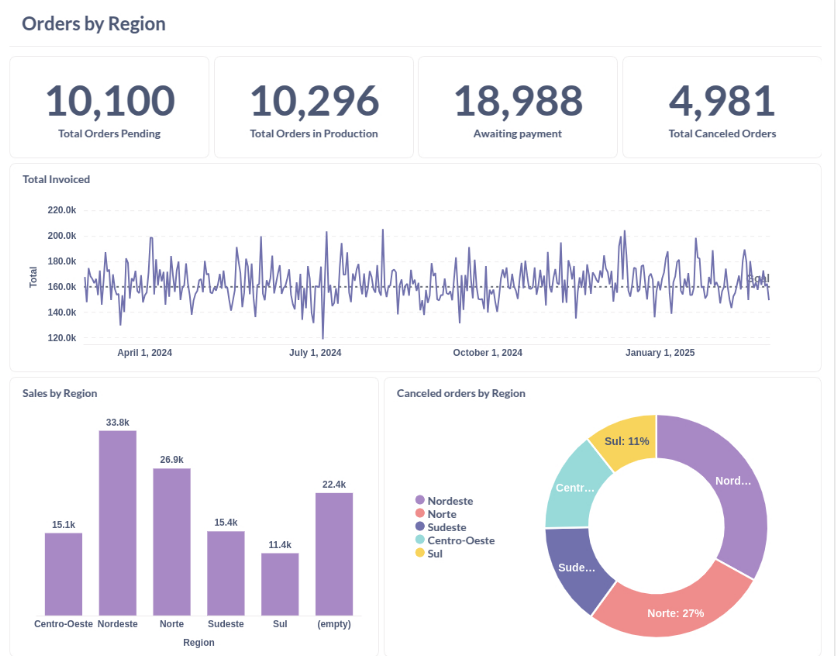

 

# ETL for Registers and Orders

This project demonstrates a complete ETL (Extract, Transform, Load) pipeline using randomly generated data for registers and orders. Data is initially generated with [Faker](https://faker.readthedocs.io/) into two tables: **Registers** and **Orders**.

## Data Overview

- **Registers Table:**  
  Contains the following fields:

  - `id`
  - `name`
  - `birth_date`
  - `cpf`
  - `postal_code`
  - `country`
  - `city`
  - `state`
  - `address_street`
  - `address_number`
  - `gender`
  - `marital_status`
  - `phone`
  - `email`
  - `register_date`

- **Orders Table:**  
  Contains the following columns:
  - `order_id`
  - `cpf`
  - `order_value`
  - `charges`
  - `discount_value`
  - `voucher`
  - `order_status`
  - `order_date`

## ETL Pipeline

The first part of the project utilizes open source tools such as **PostgreSQL** (for data storage), **dbt-core** (for data transformation), and **Metabase** (for dashboard analytics and insights).

### Transformation Architecture: The Medallion Pattern

The transformation process follows the Medallion Architecture and is organized into three layers:

- **Bronze:** Contains raw data generated by Faker.
- **Silver:** Applies transformations such as casting, deduplication (using DISTINCT on `id`), and using CASE statements to derive regional information.
- **Gold:** Aggregates key performance indicators (KPIs) that are used to build the dashboard.

dbt-core not only streamlines the transformation process but also greatly enhances documentation. The resulting data lineage is documented by dbt and is shown below:

## Dashboard

For the dashboard, I chose **Metabase** due to its simplicity and easy integration with PostgreSQL. The focus is on producing charts and insights by region—such as canceled orders, total orders, and order status. A sample dashboard is presented below:

## Packages Used

- **python:** ^3.12
- **faker:** ^36.1.1
- **python-dotenv:** ^1.0.1
- **duckdb:** ^1.2.0
- **dbt-core:** ^1.9.2
- **dbt-postgres:** ^1.9.0
- **pathlib:** ^1.0.1
- **tqdm:** ^4.67.1
- **boto3:** ^1.37.4
